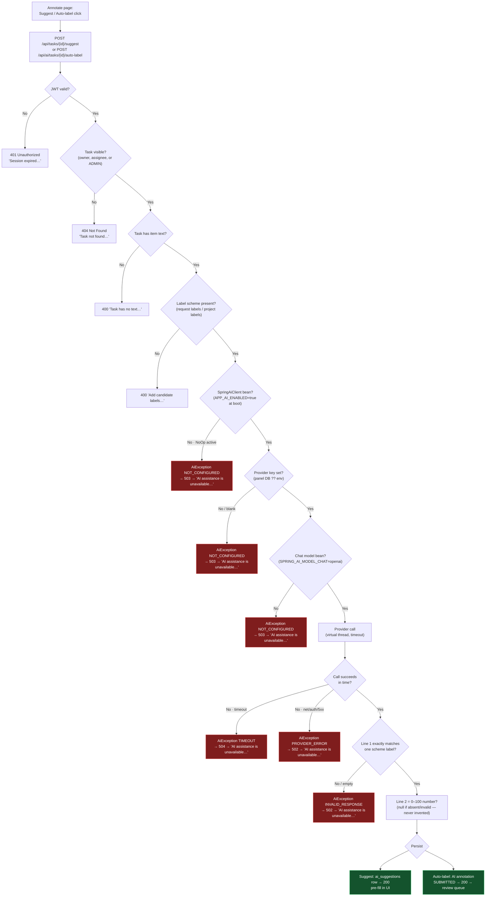

# AI Feature — Dataflow & Wiring (LabelMate)

> Frontend → backend → provider path for **Suggest** and **Auto-label**,
> every yes/no gate, and exactly when each error is thrown.

## 1. Module map

```text
FRONTEND (client/src)
  app/annotate/page.tsx          "Suggest" button → suggestLabel() · "Auto-label" → autoLabelTask()
  lib/api.ts                     suggestLabel() · autoLabelTask() · friendlyAiError()
                                 friendlyAiError: 502/503/504 → "AI assistance is unavailable…"

BACKEND (server/.../com.labelmate.labelmate)
  controller/AiSuggestionController.java   POST /api/tasks/{taskId}/suggest
  controller/AiLabelingController.java     POST /api/ai/tasks/{taskId}/auto-label
  service/AiSuggestionService.java        suggest() → stores ai_suggestions row
                                          autoLabel() → SuggestRequest via project scheme → AnnotationService.createAi()
  service/ai/LabelSuggestionService.java  buildSystemPrompt() → fit() → AiClient.complete() → parse()
  service/ai/AiClient.java                interface
  service/ai/NoOpAiClient.java            fallback bean: always throws NOT_CONFIGURED
  service/ai/SpringAiClient.java          live bean: key/builder checks → ChatClient call (virtual thread + timeout)
  service/ai/AiSettingsResolver.java      effective config: app_settings DB first, startup props second
  service/ai/AiException.java             Reason: NOT_CONFIGURED | PROVIDER_ERROR | TIMEOUT | INVALID_RESPONSE
  service/ai/SuggestionResult.java        (suggestedLabel, confidence, model)
  exception/GlobalExceptionHandler.java   handleAi(): reason → HTTP status
  config/AiConfig.java                    bean choice (see §2)
  config/AiProperties.java                app.ai.* (secret-free)
  model/AiSuggestion.java                 ai_suggestions table (task, label, confidence, model; raw_response stays null)

CONFIG SOURCES
  server/.env / env vars (startup-only, restart needed)
  app_settings table (admin panel, live) — keys OPENROUTER_API_KEY / AI_MODEL /
      OPENROUTER_BASE_URL / APP_AI_ENABLED / SPRING_AI_MODEL_CHAT
```

## 2. Wiring (which bean lives?)

```text
Boot reads server/.env
  │
  ├─ APP_AI_ENABLED=true ──→ AiConfig creates SpringAiClient ──→ live path
  │                            (needs ChatClient.Builder ← SPRING_AI_MODEL_CHAT=openai)
  │
  └─ anything else ──→ AiConfig creates NoOpAiClient ──→ every call throws
                          NOT_CONFIGURED ("AI assistance is disabled…") → HTTP 503

Per call, SpringAiClient resolves via AiSettingsResolver (DB first):
  key   = app_settings.OPENROUTER_API_KEY  ??  spring.ai.openai.api-key (env)
  model = app_settings.AI_MODEL             ??  app.ai.model            (recorded on suggestion)
  (base URL + chat backend are baked at startup → restart to change)
```

## 3. Frontend → backend sequence

```text
Suggest:    Annotate page [Suggest]
              → suggestLabel(taskId, labels[]) → POST /api/tasks/{id}/suggest {labels}
              → AiSuggestionController → AiSuggestionService.suggest()
              → stores ai_suggestions row → 200 SuggestionResponse
              → page pre-fills label + confidence (human still submits manually)

Auto-label: Annotate page [Auto-label]
              → autoLabelTask(taskId) → POST /api/ai/tasks/{id}/auto-label
              → AiLabelingController → AiSuggestionService.autoLabel()
              → scheme comes from PROJECT labels (never client input)
              → AnnotationService.createAi() → persisted as source=AI, status=SUBMITTED
              → review still decides (never final)
```

## 4. Yes/no flowchart (both endpoints)



## 5. Error table (when is it thrown?)

| # | Gate that failed | Throw site | `AiException.Reason` | HTTP | UI message |
|---|---|---|---|---|---|
| 1 | AI bean off (`APP_AI_ENABLED≠true` at boot) | `NoOpAiClient.complete` | `NOT_CONFIGURED` | 503 | AI assistance is unavailable… |
| 2 | Key blank (panel DB empty AND env empty) | `SpringAiClient.complete` | `NOT_CONFIGURED` | 503 | AI assistance is unavailable… |
| 3 | No chat model (`SPRING_AI_MODEL_CHAT=none`) | `SpringAiClient.complete` | `NOT_CONFIGURED` | 503 | AI assistance is unavailable… |
| 4 | Network/auth/rate-limit/5xx | `SpringAiClient.complete` | `PROVIDER_ERROR` | 502 | AI assistance is unavailable… |
| 5 | Slower than `requestTimeoutSeconds` | `SpringAiClient.complete` | `TIMEOUT` | 504 | AI assistance is unavailable… |
| 6 | Empty reply or line-1 off-scheme | `LabelSuggestionService.parse` | `INVALID_RESPONSE` | 502 | AI assistance is unavailable… |
| – | No JWT | filter | – | 401 | Session expired… |
| – | Task hidden / no text / no labels | `AiSuggestionService` | `ApiException` | 404 / 400 | Task / labels message |

All six AI failures degrade to **manual labeling** — nothing is persisted
(`shouldPropagateAiFailureWithoutPersisting`), nothing auto-approves.

## 6. Config dependency (env vs panel)

| Setting | Env (`server/.env`) | Admin panel (`app_settings`) | Applies |
|---|---|---|---|
| AI bean on/off | `APP_AI_ENABLED` — selects bean | `APP_AI_ENABLED` override | restart |
| Chat backend | `SPRING_AI_MODEL_CHAT` (`openai`/`none`) | `SPRING_AI_MODEL_CHAT` field | restart |
| Provider endpoint | `OPENROUTER_BASE_URL` | `OPENROUTER_BASE_URL` field | restart |
| Provider key | `OPENROUTER_API_KEY` (fallback) | key field (masked `****last4`) | **live** |
| Model name | `AI_MODEL` (fallback) | model field (recorded per suggestion) | **live** |

Panel status pill derives from the same gates: `live = beanActive && enabled && keyConfigured`.
```

## Wiring files touched earlier (for reference)

- `service/ai/AiSettingsResolver.java` (new) — DB-first resolution
- `service/ai/SpringAiClient.java` — per-call key via resolver
- `service/ai/LabelSuggestionService.java` — recorded model via resolver
- `config/AiConfig.java` — passes resolver (optional, tests safe)
- `service/AdminService.java` + `controller/AdminController.java` — panel CRUD + `live`
- `client/.../admin/settings/page.tsx` + `lib/api.ts` — panel UI + status
