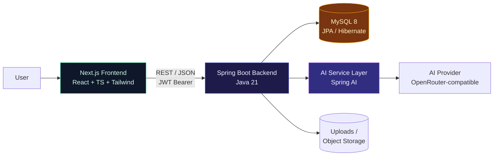
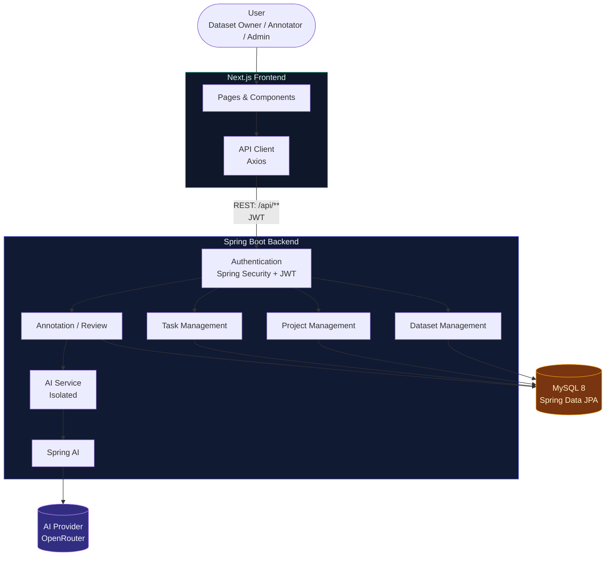
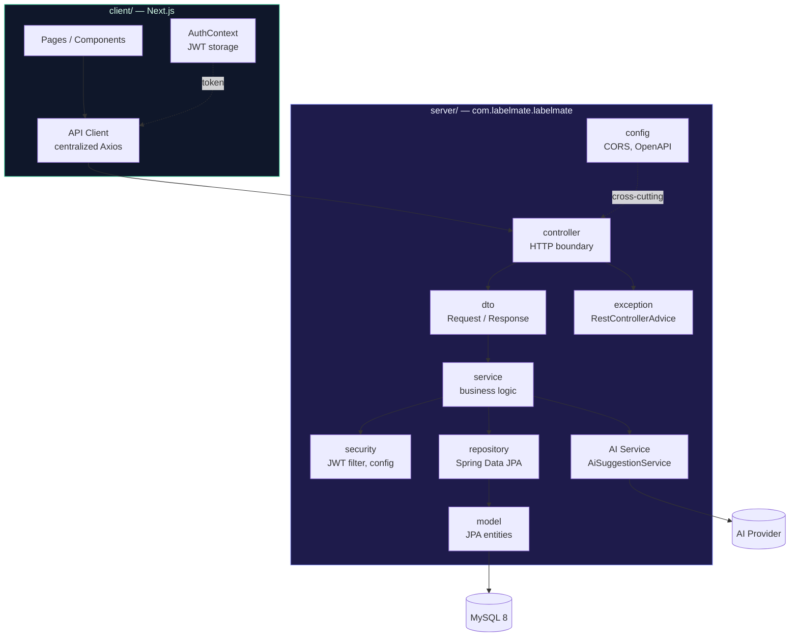
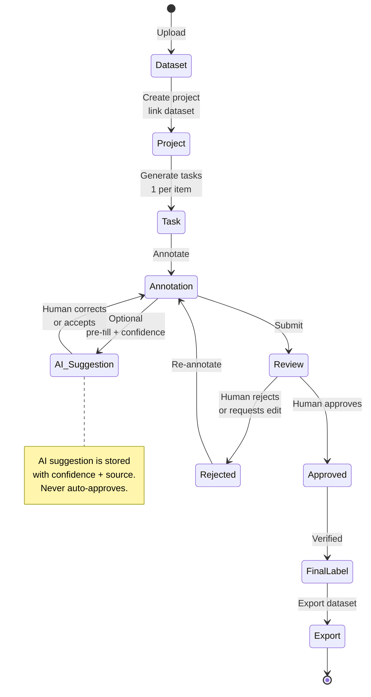
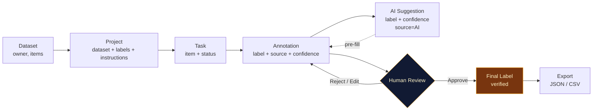
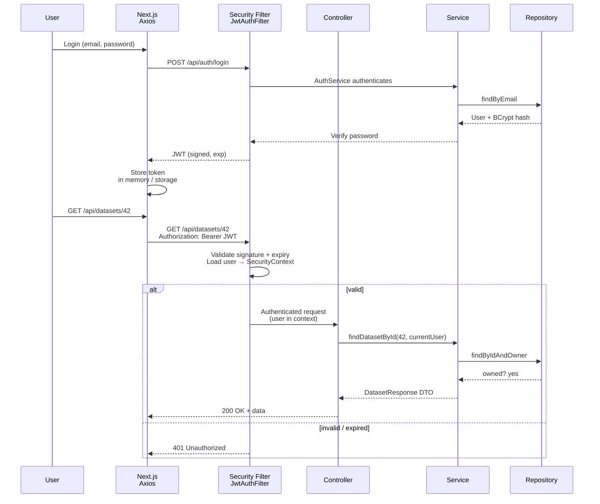
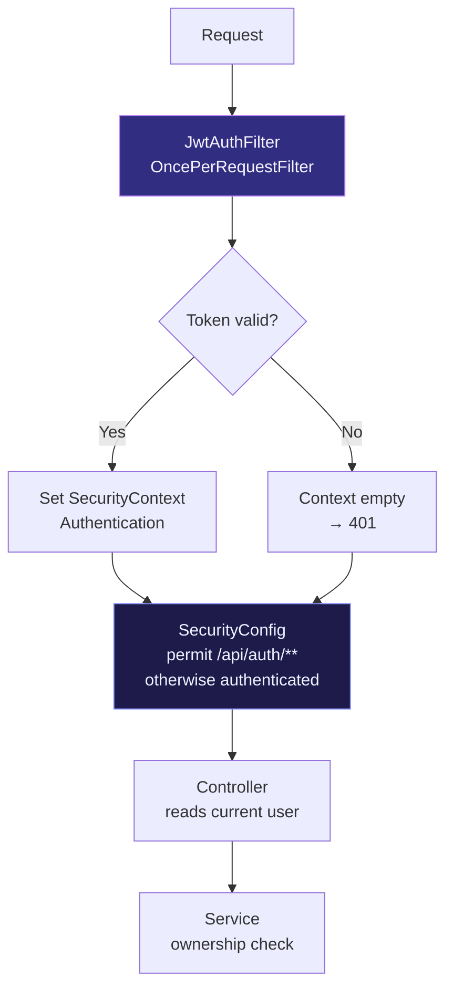
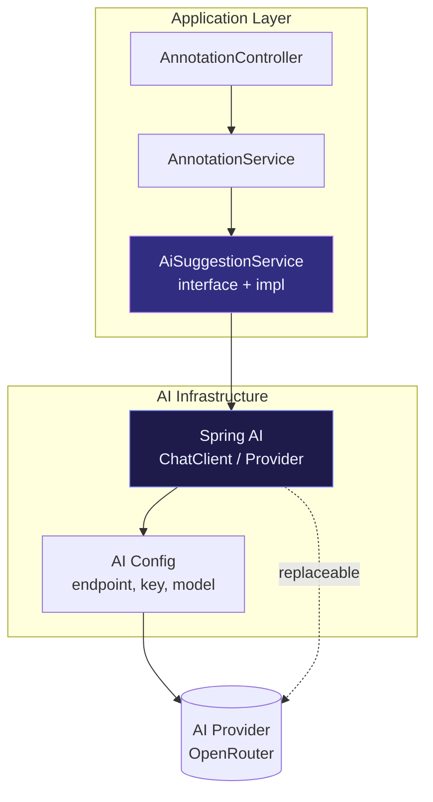
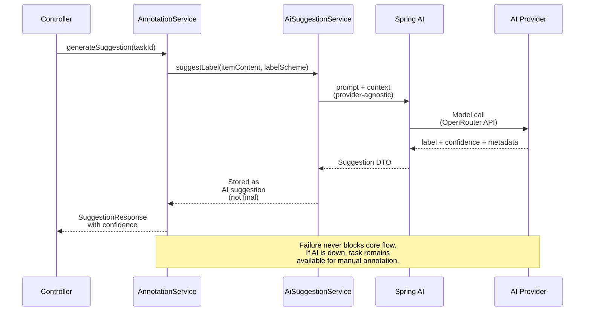
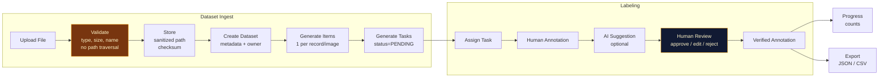

# Architecture — LabelMate

> **Status:** Day 3 — July 31, 2026 · Initial architecture foundation
> **Stack:** Java 21 · Spring Boot · MySQL 8 · Next.js · Spring AI
> **Rule:** AI is assistive, not authoritative — human review is the source of truth.

---

## 1. Architecture Overview

LabelMate is a **monolithic Spring Boot backend + Next.js frontend + MySQL** product that implements a single workflow:

```
Dataset → Project → Task → Annotation → AI Suggestion → Human Review → Final Label → Export
```

The backend owns all business rules, authentication, file validation, and AI orchestration. The frontend is a thin React UI that calls the backend REST API. The AI layer is isolated behind a replaceable service interface so the provider can change without touching core annotation logic.

Design goals for this milestone: **understandable, secure, testable** — no premature microservices, CQRS, or Kubernetes.



`*` Local filesystem in development; replaceable with cloud object storage later.

---

## 2. System Context

Actors and system boundaries. The backend is the only component that talks to the database and the AI provider.



**Boundaries:**
- Frontend never talks directly to MySQL or the AI provider.
- Every request passes the authentication boundary.
- All persistence goes through `repository` → MySQL.
- All AI calls go through `AI Service` → `Spring AI` → provider.

---

## 3. High-Level Component Architecture

Backend package structure per AGENTS.md. Frontend keeps API calls separate from presentation.



**Request flow (preferred):**
```
HTTP Request → Controller → DTO + Validation → Service → Repository → Database → Service → DTO → Controller → HTTP Response
```
Controllers never touch repositories. Repositories never contain business rules.

---

## 4. Core Labeling Workflow

The product workflow is a state machine. Task status transitions are deliberate, and the final label is always human-approved.





**State rules:**
- No arbitrary status jumps — service checks current status before transition.
- `HUMAN`, `AI`, and `HUMAN_APPROVED` are distinguishable in storage (source + review state + confidence retained).

---

## 5. Authentication Boundary

Stateless JWT. The filter runs before any controller logic. Server-side authorization enforces ownership.





**Rules:**
- Passwords are BCrypt-hashed, never stored or logged in plaintext.
- `JWT_SECRET`, `OPENROUTER_API_KEY`, `DATABASE_PASSWORD` come from environment — never committed.
- Frontend guards are UX only. Authorization is server-side on every service method (e.g., `validateDatasetOwnership`).

---

## 6. AI Integration Boundary

AI is a replaceable module. Direct provider calls are forbidden outside the AI service.





**Safety rules:**
- Suggestion retains `source=AI`, `confidence`, and `reviewState=PENDING`.
- A new AI result never overwrites a `HUMAN_APPROVED` label.
- The provider is configured via environment; swapping it requires only changing `AI Service` + config.

---

## 7. Data Flow

Uploads are untrusted and validated. Every flow returns DTOs, never entities.



**Upload validation (per File Upload Rules):**
- Allowed extensions and MIME types, size limits, filename sanitization, path-traversal guard (`targetPath.startsWith(uploadDir)`), ownership check, and no direct use of the original filename for storage.

---

## 8. Technology Stack

| Layer | Technology | Purpose |
|---|---|---|
| Backend | Java 21, Spring Boot (Web, Data JPA, Security, Validation) | REST API, business logic, validation |
| Database | MySQL 8, Hibernate / Spring Data JPA | Persistence, FK constraints |
| Frontend | Next.js, React, TypeScript, Tailwind CSS | UI, type-safe pages |
| HTTP | Axios (centralized client) | API calls from frontend |
| Auth | Spring Security, BCrypt, JWT | Stateless authentication |
| AI | Spring AI, OpenRouter-compatible | Replaceable AI suggestions |
| Docs | OpenAPI / Swagger | API documentation when required |
| Build | Maven | Backend build |
| Testing | JUnit 5, Mockito, MockMvc | Service + controller tests |
| DevOps (progressive) | Git, GitHub, GitHub Actions, Docker, Docker Compose | CI, containerization, deployment later |

All choices are standard, explainable to a Semester-5 student. No microservices, CQRS, event sourcing, or Kubernetes at this stage.

---

## 9. Architectural Responsibilities

Backend packages (`com.labelmate.labelmate`):

| Package | Owns | Does not own |
|---|---|---|
| `config` | CORS, OpenAPI, bean configuration | Business logic |
| `controller` | HTTP boundary, DTO binding, validation trigger, call service | Queries, AI calls, large validation |
| `dto` | `LoginRequest`, `DatasetResponse`, `AnnotationRequest` etc. | Sensitive entity fields |
| `exception` | Custom exceptions, `@RestControllerAdvice`, safe error responses | Stack traces to clients |
| `model` | JPA entities: `User`, `Dataset`, `Project`, `Task`, `Annotation`, `Review` | API formatting |
| `repository` | `JpaRepository` interfaces, persistence only | Workflow rules |
| `security` | JWT issue/validate, filter, password encoder, current-user resolution | Scattered auth checks |
| `service` | Validation, ownership, state transitions, AI orchestration, transactions | HTTP details |

Frontend (`client/`):

| Layer | Responsibility |
|---|---|
| `Page / Component` | Render UI, call API client |
| `API Client` | Centralized base URL, JWT header, response unwrapping |
| `Spring Boot API` | Source of truth — no fake data after backend is connected |

Cross-cutting: validation at the API boundary (Jakarta Bean Validation on DTOs, backend is authoritative), centralized error handling, environment-based secrets.

---

## 10. Initial Architecture Decisions

| Decision | Choice | Why | Trade-off |
|---|---|---|---|
| Backend style | Monolithic Spring Boot | Simplest to understand, test, and deploy for a solo student; one codebase, one DB, one deployment | Not independently scalable per domain — acceptable until proven bottleneck |
| Database | MySQL 8 + JPA | Relational, matches domain relationships (Dataset→Project→Task→Annotation), familiar tooling | Requires careful schema design; no document-store flexibility at this stage |
| Auth | Stateless JWT + BCrypt | Stateless, no server session, works with REST and Next.js; BCrypt is standard | Token revocation needs extra handling if required later |
| Package layout | `config, controller, dto, exception, model, repository, security, service` | Conventional, matches Spring guides, maps cleanly to test layers | Avoids over-abstracted layers (`helper`, `manager`) |
| Validation | Jakarta Bean Validation at DTO boundary | Frontend validation is UX only; backend is authoritative | Duplicate validation messages if not coordinated |
| AI | Isolated `AiSuggestionService` → Spring AI → provider | Core app works without AI; provider is replaceable without touching controllers | Extra interface is overhead until AI feature ships — justified as boundary |
| File storage | Local `uploads/` now, abstraction later | Fast for MVP, path-traversal guarded, not committed to Git | Needs cloud object storage before large-scale datasets |
| Testing | JUnit 5 + Mockito + MockMvc | Service mocks repos, controller tests verify HTTP + auth | Integration tests deferred until DB is present |
| DTOs | Not exposing entities | Prevents password leakage, circular JSON, over-fetching | Mapping code is required |
| DI | Constructor injection (`@RequiredArgsConstructor`) | Immutable, visible dependencies, testable | Field injection is forbidden |

All decisions favor clarity over cleverness and keep the system teachable.

---

## 11. Current Scope and Future Scope

### Current scope (Day 3 — architecture foundation)

- Problem and project context defined (commits 01–02).
- Architecture document (`docs/architecture.md`) with System Context, component, workflow, auth, AI, and data-flow views.
- No source code, no database schema, no AI implementation, no Docker/CI yet.

### Next scope (per capstone progression)

- Backend initialization (`chore(backend): initialize spring boot application`)
- Database configuration (MySQL, JPA entities, migrations)
- Authentication foundation (User, JWT, security filter)
- Dataset → Project → Task → Annotation workflow, iteratively, with tests

### Future scope (not in this commit)

- ER diagram and class/module diagram that match the implemented schema.
- API documentation via OpenAPI/Swagger.
- Containerization (Docker, Compose) and CI/CD (GitHub Actions).
- Deployment, health checks, and logging.
- AI suggestions in production with confidence and review enforcement.
- Dataset export and progress tracking.

This document will be updated when implementation diverges from the diagram. Diagram ≠ Code is not allowed.
