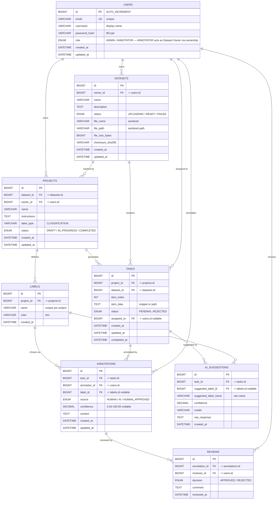

# Database Design — LabelMate

> **Status:** Day 4 — August 1, 2026 · Design only, no implementation yet
> **Stack:** MySQL 8 · Spring Data JPA / Hibernate · Java 21
> **Rule:** AI is assistive — human review determines the final label. The schema must make that distinction visible.

---

## 1. Database Overview

LabelMate uses a **single relational MySQL 8 database** accessed via Spring Data JPA. The model follows the product workflow:

```
Dataset → Project → Task → Annotation → AI Suggestion → Human Review → Final Label → Export
```

Nine tables cover the current scope. No microservices, no event tables, no billing tables at this stage. Every table uses InnoDB, `utf8mb4`, and surrogate `BIGINT` primary keys. Ownership is explicit and enforced server-side.

Tables (current scope):

- `users`
- `registration_otps`
- `datasets`
- `dataset_items`
- `projects`
- `labels`
- `tasks`
- `annotations`
- `reviews`
- `ai_suggestions`

`sessions`, `migrations`, and storage artefacts are not modeled; file bytes live on disk/object storage, only metadata is stored in the database.

---

## 2. Design Principles

- **Relational and normalized** — no duplicated data without justification. The schema models real domain relationships with foreign keys.
- **Simple for a Semester-5 developer** — monolithic, one database, one JPA model. No CQRS, no distributed tables.
- **Ownership explicit** — every dataset, project, and task has an `owner_id` or `assigned_to` that the service layer must check.
- **AI isolated** — AI output lives in its own table (`ai_suggestions`) and never overwrites a human-approved annotation.
- **Review is explicit** — `annotations` and `reviews` are separate so that source, confidence, review state, and final approval are never conflated.
- **Constraints over conventions** — uniqueness and integrity are enforced by the database (unique email, unique label per project, FK constraints), not only by application code.
- **Understandable types** — `BIGINT`, `VARCHAR`, `TEXT`, `ENUM`, `DATETIME`, `DECIMAL(5,2)` for confidence. No exotic types.
- **No premature optimization** — indexes only where ownership filtering, status filtering, or uniqueness requires them.

---

## 3. Entities

| Entity | Purpose | Justified by |
|---|---|---|
| `users` | Authentication and ownership. Maps to the three PROJECT actors: `ADMIN` → Administrator, `ANNOTATOR` → both Dataset Owner and Annotator (Dataset Owner is derived from `datasets.owner_id` / `projects.owner_id`, not a separate role value). | Problem statement + PROJECT.md §4: distinct actors, ownership checked server-side; keeps RBAC to two values per capstone success criteria while supporting all three capabilities. |
| `datasets` | Metadata for an uploaded dataset (title, description, status, file reference). | Core workflow starts at Dataset; ownership and upload validation require a record. |
| `projects` | Annotation configuration over a single dataset (labels, instructions, status). Joins a dataset to its labeling work. | Architecture: Project configures annotation over a Dataset. |
| `labels` | Label options belonging to a project (e.g., Cat, Dog, Car). One project has many labels. | Project needs an explicit label scheme; separate table enforces uniqueness per project. |
| `tasks` | A unit of annotation work — one task per dataset item. Tracks status and assignment. | Architecture: Task is the assignable unit; status transitions are deliberate. |
| `annotations` | A label produced for a task (by a human). Stores the chosen label, source, and confidence when it originated from AI. | Collaboration requires distinguishing human work from AI pre-fill. |
| `reviews` | Human decision on an annotation (approve, reject, edit) with an optional comment. | Product rule: human review is the source of truth. |
| `ai_suggestions` | AI-generated suggestion for a task with confidence and model metadata. Never auto-approved. | AI Safety: suggestions must be retained separately, with confidence, and never silently become final. |
| `registration_otps` | Pending email-verification for two-step signup (email, username, BCrypt password hash, SHA-256 code hash, expiry, attempts). Deleted after verification. | Registration must verify email ownership without creating unverified `users` rows; only the code hash is stored. |

`Role` is **not a separate table** — it is an `ENUM('ADMIN','ANNOTATOR')` column on `users`. `ADMIN` is the platform Administrator; `ANNOTATOR` covers both **Dataset Owner** and **Annotator** capabilities from PROJECT.md §4. Whether an `ANNOTATOR` acts as a Dataset Owner is determined by ownership (`datasets.owner_id = users.id` and `projects.owner_id = users.id`), not by a third static role value — this matches architecture.md System Context `User — Dataset Owner / Annotator / Admin` where Dataset Owner is a resource-level responsibility. A dedicated `roles` table would add no value at this scale; the fixed two-value set is validated by the application and satisfies the capstone requirement of at least two distinct roles.

---

## 4. Entity Attributes

### 4.1 `users`

| Column | Type | Null | Notes |
|---|---|---|---|
| `id` | `BIGINT AUTO_INCREMENT` | NO | PK |
| `email` | `VARCHAR(255)` | NO | UK — login identifier |
| `username` | `VARCHAR(100)` | NO | Display name |
| `password_hash` | `VARCHAR(255)` | NO | BCrypt hash — never the raw password |
| `role` | `ENUM('ADMIN','ANNOTATOR')` | NO | Default `ANNOTATOR` — `ANNOTATOR` acts as Dataset Owner when `datasets.owner_id`/`projects.owner_id` matches `users.id`; `ADMIN` is the Administrator. |
| `created_at` | `DATETIME` | NO | Set at registration |
| `updated_at` | `DATETIME` | YES | On profile update |

No `is_active` yet — deferred to future scope to keep Day 4 simple.

### 4.2 `datasets`

| Column | Type | Null | Notes |
|---|---|---|---|
| `id` | `BIGINT AUTO_INCREMENT` | NO | PK |
| `owner_id` | `BIGINT` | NO | FK → `users.id` |
| `name` | `VARCHAR(150)` | NO | Human-readable title |
| `description` | `TEXT` | YES | Purpose of the dataset |
| `status` | `ENUM('UPLOADING','READY','FAILED')` | NO | Initial `READY` for MVP; future file-processing states possible |
| `file_name` | `VARCHAR(255)` | YES | Sanitized stored name (not raw upload name) |
| `file_path` | `VARCHAR(500)` | YES | Sanitized relative path — validated against path traversal |
| `file_size_bytes` | `BIGINT` | YES | From upload validation |
| `checksum_sha256` | `VARCHAR(64)` | YES | Optional dedup aid |
| `columns_json` | `TEXT` | YES | Ordered column header for tabular datasets (JSON array); null = single-content |
| `created_at` | `DATETIME` | NO | |
| `updated_at` | `DATETIME` | YES | |

### 4.2b `dataset_items`

| Column | Type | Null | Notes |
|---|---|---|---|
| `id` | `BIGINT AUTO_INCREMENT` | NO | PK |
| `dataset_id` | `BIGINT` | NO | FK → `datasets.id` — the raw content pool tasks generate from |
| `content` | `TEXT` | NO | Full text, row summary (`col: val \| …`), or image caption/filename |
| `row_data_json` | `TEXT` | YES | Full multi-column row as a JSON object; null for text/image items |
| `image_url` | `VARCHAR(1024)` | YES | e.g., `/uploads/images/uuid.png`; null for non-image items |
| `media_type` | `VARCHAR(64)` | YES | e.g., `image/png`; null for non-image items |
| `created_at` | `DATETIME` | NO | |

### 4.3 `projects`

| Column | Type | Null | Notes |
|---|---|---|---|
| `id` | `BIGINT AUTO_INCREMENT` | NO | PK |
| `dataset_id` | `BIGINT` | NO | FK → `datasets.id` — one dataset, many projects allowed but one is common |
| `owner_id` | `BIGINT` | NO | FK → `users.id` — denormalized for fast ownership check (must match dataset owner) |
| `name` | `VARCHAR(150)` | NO | e.g., "Image Classification v1" |
| `instructions` | `TEXT` | YES | Annotation guidelines shown to annotators |
| `label_type` | `VARCHAR(50)` | YES | `CLASSIFICATION`, `MULTI_CLASS` etc. — kept simple as VARCHAR now |
| `status` | `ENUM('DRAFT','IN_PROGRESS','COMPLETED')` | NO | Default `DRAFT` |
| `created_at` | `DATETIME` | NO | |
| `updated_at` | `DATETIME` | YES | |

### 4.4 `labels`

| Column | Type | Null | Notes |
|---|---|---|---|
| `id` | `BIGINT AUTO_INCREMENT` | NO | PK |
| `project_id` | `BIGINT` | NO | FK → `projects.id` |
| `name` | `VARCHAR(100)` | NO | e.g., "Cat" — unique per project |
| `color` | `VARCHAR(7)` | YES | Hex color for UI chip, e.g., `#3b82f6` |
| `created_at` | `DATETIME` | NO | |

### 4.5 `tasks`

| Column | Type | Null | Notes |
|---|---|---|---|
| `id` | `BIGINT AUTO_INCREMENT` | NO | PK |
| `project_id` | `BIGINT` | NO | FK → `projects.id` |
| `dataset_id` | `BIGINT` | NO | FK → `datasets.id` — denormalized for ownership filtering without extra joins |
| `dataset_item_id` | `BIGINT` | YES | FK → `dataset_items.id` — set for generated tasks; null for manually queued items |
| `item_index` | `INT` | YES | Position inside the dataset (0-based) — useful for export ordering |
| `item_data` | `TEXT` | YES | Snippet or file reference for the item (image path or text excerpt) |
| `status` | `ENUM('PENDING','ASSIGNED','IN_PROGRESS','SUBMITTED','APPROVED','REJECTED')` | NO | Default `PENDING` |
| `assigned_to` | `BIGINT` | YES | FK → `users.id` — nullable until a human claims the task |
| `created_at` | `DATETIME` | NO | |
| `updated_at` | `DATETIME` | YES | |
| `completed_at` | `DATETIME` | YES | When `APPROVED` |

### 4.6 `annotations`

| Column | Type | Null | Notes |
|---|---|---|---|
| `id` | `BIGINT AUTO_INCREMENT` | NO | PK |
| `task_id` | `BIGINT` | NO | FK → `tasks.id` — one task has at most one current annotation, but history is preserved by never hard-deleting and by review state |
| `annotator_id` | `BIGINT` | NO | FK → `users.id` — who created this annotation |
| `label_id` | `BIGINT` | YES | FK → `labels.id` — the chosen label (nullable until annotated) |
| `source` | `ENUM('HUMAN','AI','HUMAN_APPROVED')` | NO | How this row originated; `HUMAN_APPROVED` only after review |
| `confidence` | `DECIMAL(5,2)` | YES | Copied from AI suggestion when the human accepts it; null for pure manual work |
| `content` | `TEXT` | YES | Optional free-form or JSON payload for complex label types |
| `created_at` | `DATETIME` | NO | |
| `updated_at` | `DATETIME` | YES | |

`source` plus the presence of a `reviews` row distinguishes `AI suggestion` vs `human annotation` vs `final label`.

### 4.7 `reviews`

| Column | Type | Null | Notes |
|---|---|---|---|
| `id` | `BIGINT AUTO_INCREMENT` | NO | PK |
| `annotation_id` | `BIGINT` | NO | FK → `annotations.id` — unique (one current review per annotation, new reviews create a new row) |
| `reviewer_id` | `BIGINT` | NO | FK → `users.id` |
| `decision` | `ENUM('APPROVED','REJECTED')` | NO | `APPROVED` makes `annotation.source = HUMAN_APPROVED` and `tasks.status = APPROVED` |
| `comment` | `TEXT` | YES | Reason for rejection or edit note |
| `reviewed_at` | `DATETIME` | NO | |

### 4.8 `ai_suggestions`

| Column | Type | Null | Notes |
|---|---|---|---|
| `id` | `BIGINT AUTO_INCREMENT` | NO | PK |
| `task_id` | `BIGINT` | NO | FK → `tasks.id` — one latest suggestion per task (history can accumulate) |
| `suggested_label_id` | `BIGINT` | YES | FK → `labels.id` — the label the model proposed |
| `suggested_label_name` | `VARCHAR(100)` | YES | Denormalized name for when the model proposes a label not yet in `labels` |
| `confidence` | `DECIMAL(5,2)` | YES | `0.00–100.00`; shown to the human |
| `model` | `VARCHAR(100)` | YES | e.g., `openrouter/mistral` — for traceability |
| `raw_response` | `TEXT` | YES | Trimmed provider response for debugging — never a secret |
| `created_at` | `DATETIME` | NO | |

---

## 5. Primary Keys

- All tables use a single surrogate `BIGINT AUTO_INCREMENT` primary key named `id`.
- No composite primary keys. Foreign keys are separate columns.
- Surrogate keys keep joins simple, make JPA `@Id @GeneratedValue` trivial, and avoid leaking business meaning into identifiers.

Example:

```sql
users        PK (id)
datasets     PK (id)
dataset_items PK (id)
projects     PK (id)
labels       PK (id)
tasks        PK (id)
annotations  PK (id)
reviews      PK (id)
ai_suggestions PK (id)
```

---

## 6. Foreign Keys

All foreign keys are enforced by InnoDB and indexed automatically. Deletion uses `RESTRICT` by default — parent rows are not deleted while children exist; soft-delete or explicit service logic is preferred over `CASCADE`.

| FK | From | To | On Delete | On Update |
|---|---|---|---|---|
| `datasets.owner_id` | `datasets` | `users.id` | `RESTRICT` | `CASCADE` |
| `dataset_items.dataset_id` | `dataset_items` | `datasets.id` | `RESTRICT` | `CASCADE` |
| `projects.dataset_id` | `projects` | `datasets.id` | `RESTRICT` | `CASCADE` |
| `projects.owner_id` | `projects` | `users.id` | `RESTRICT` | `CASCADE` |
| `labels.project_id` | `labels` | `projects.id` | `RESTRICT` | `CASCADE` |
| `tasks.project_id` | `tasks` | `projects.id` | `RESTRICT` | `CASCADE` |
| `tasks.dataset_id` | `tasks` | `datasets.id` | `RESTRICT` | `CASCADE` |
| `tasks.dataset_item_id` | `tasks` | `dataset_items.id` | `RESTRICT` | `CASCADE` |
| `tasks.assigned_to` | `tasks` | `users.id` | `SET NULL` | `CASCADE` |
| `annotations.task_id` | `annotations` | `tasks.id` | `RESTRICT` | `CASCADE` |
| `annotations.annotator_id` | `annotations` | `users.id` | `RESTRICT` | `CASCADE` |
| `annotations.label_id` | `annotations` | `labels.id` | `RESTRICT` | `CASCADE` |
| `reviews.annotation_id` | `reviews` | `annotations.id` | `RESTRICT` | `CASCADE` |
| `reviews.reviewer_id` | `reviews` | `users.id` | `RESTRICT` | `CASCADE` |
| `ai_suggestions.task_id` | `ai_suggestions` | `tasks.id` | `RESTRICT` | `CASCADE` |
| `ai_suggestions.suggested_label_id` | `ai_suggestions` | `labels.id` | `SET NULL` | `CASCADE` |

`SET NULL` for `assigned_to` and `suggested_label_id` allows reassignment and model-proposed labels that are not yet in the label set.

---

## 7. Relationships

- `users` **1 — * `datasets` — a user owns many datasets.
- `users` **1 — * `projects` — a user owns many projects (must match dataset owner in service logic).
- `datasets` **1 — * `projects` — a dataset can back multiple projects.
- `projects` **1 — * `labels` — a project defines its label set.
- `projects` **1 — * `tasks` — a project generates many tasks.
- `datasets` **1 — * `tasks` — denormalized: a task belongs to a dataset for fast ownership filtering.
- `labels` **1 — * `annotations` — a label can be chosen many times.
- `tasks` **1 — * `annotations` — a task has many annotation attempts over time, but only one is current.
- `tasks` **1 — * `ai_suggestions` — a task can have many AI suggestions (history), one is latest.
- `annotations` **1 — * `reviews` — an annotation can be reviewed multiple times if rejected and re-annotated; latest review determines approval.
- `users` **1 — * `tasks.assigned_to` — a user can be assigned many tasks.
- `users` **1 — * `annotations.annotator_id` — a user can create many annotations.
- `users` **1 — * `reviews.reviewer_id` — a user can review many annotations.

All relationships are mandatory on the child side except `assigned_to`, `suggested_label_id`, and `annotations.label_id` before annotation is complete.

---

## 8. Cardinality

| Relationship | Cardinality | Enforced by |
|---|---|---|
| `users` : `datasets` | 1 : * | `datasets.owner_id` FK + index |
| `users` : `projects` | 1 : * | `projects.owner_id` FK |
| `datasets` : `projects` | 1 : * | `projects.dataset_id` FK |
| `projects` : `labels` | 1 : * | `labels.project_id` FK + unique `(project_id, name)` |
| `projects` : `tasks` | 1 : * | `tasks.project_id` FK |
| `datasets` : `tasks` | 1 : * | `tasks.dataset_id` FK |
| `labels` : `annotations` | 1 : * | `annotations.label_id` FK |
| `tasks` : `annotations` | 1 : * | `annotations.task_id` FK — current annotation resolved by latest `created_at` |
| `tasks` : `ai_suggestions` | 1 : * | `ai_suggestions.task_id` FK |
| `annotations` : `reviews` | 1 : * | `reviews.annotation_id` FK — latest review decides |
| `users` : `tasks` (assignee) | 1 : * | `tasks.assigned_to` FK nullable |
| `users` : `reviews` (reviewer) | 1 : * | `reviews.reviewer_id` FK |

No many-to-many tables are needed in Day 4. Project membership beyond ownership is deferred.

---

## 9. Important Constraints

**Uniqueness:**
- `users.email` is `UNIQUE` — one account per email, checked at registration.
- `labels(project_id, name)` is `UNIQUE` — label names are unique within a project, but the same name can appear in different projects.

**Not-null integrity:**
- All `id`, `owner_id`, `dataset_id`, `project_id`, `task_id`, `annotation_id`, `annotator_id`, `reviewer_id`, `role`, `status`, `source`, `decision` are `NOT NULL`.
- `tasks.assigned_to`, `ai_suggestions.suggested_label_id`, `annotations.confidence`, `annotations.label_id` before submission are nullable by design.

**Check / ENUM constraints:**
- `users.role`, `datasets.status`, `projects.status`, `tasks.status`, `annotations.source`, `reviews.decision` are `ENUM`s — invalid values are rejected by the database, not only by Java.
- `confidence` is constrained to `0.00–100.00` at the application layer and can be bounded by a DB `CHECK (confidence BETWEEN 0 AND 100)` where MySQL supports it.

**Foreign-key integrity:** All FKs are real constraints (not just JPA hints).

**Ownership constraints (application + DB):**
- `projects.owner_id` must equal `datasets.owner_id` for the linked dataset — enforced by service check `validateProjectOwnership` and by not allowing `dataset_id` to be changed after creation.

**File integrity (application):**
- `datasets.file_path` is a sanitized relative path — must pass `targetPath.startsWith(uploadDir)` before persistence.

No `UNIQUE` on `tasks(project_id, item_index)` is added yet; it can be added when `item_index` becomes a business identifier. For now the application generates tasks sequentially.

---

## 10. Ownership Rules

Ownership is the authorization boundary. Every service method must verify the current user owns the resource before returning or mutating it.

- **Dataset** — only `datasets.owner_id` can read, update, or delete the dataset and its file. `findByIdAndOwnerId` is the repository pattern.
- **Project** — only `projects.owner_id` can view, edit, add labels to, or generate tasks for the project. The service verifies both `project.owner_id == currentUser.id` and `project.dataset.owner_id == currentUser.id`.
- **Task** — visible to the project owner and to the assigned annotator. `validateTaskAccess` checks `task.project.owner_id == currentUser.id` **or** `task.assigned_to == currentUser.id`. Unassigned `PENDING` tasks are pool-visible only to annotators of that project.
- **Annotation** — only `annotator_id` or the project owner can view the draft before submission; after `SUBMITTED` the reviewer can view it.
- **Review** — only a user with `role = ADMIN` or the project owner (depending on the project's review policy) can create a review. The reviewer must not be the original annotator for the same annotation (enforced by service).
- **AI Suggestion** — any user who can view the task can view its latest suggestion; creation is restricted to the service layer calling the AI provider.

Ownership checks are **server-side** — frontend hides are UX only.

---

## 11. Annotation / Review Data Model

The model keeps three states distinct by storage, not by convention alone:

```
AI suggestion  →  ai_suggestions (source=AI, confidence, model)
Human draft    →  annotations (source=HUMAN, confidence nullable)
Final label    →  annotations (source=HUMAN_APPROVED) + reviews (decision=APPROVED)
```

- **Annotation row** — `source` is `HUMAN` while being edited, becomes `HUMAN_APPROVED` only after a `reviews` row with `APPROVED`. The row retains `label_id` and the `confidence` that was copied from the AI suggestion (if any) so traceability is preserved.
- **Review row** — `reviews.annotation_id` is `UNIQUE` for the current review, but a new row can be created if the annotation is rejected, edited, and re-reviewed. `reviews.decision` is `APPROVED` or `REJECTED`. `reviews.comment` explains rejection.
- **Task status** — `tasks.status` mirrors the workflow: `PENDING → ASSIGNED → IN_PROGRESS → SUBMITTED → APPROVED` or `REJECTED`. The service transitions `REJECTED` back to `IN_PROGRESS` for re-annotation.
- **No silent promotion** — inserting a new `ai_suggestions` row never updates `annotations.source` to `HUMAN_APPROVED`. Only a `reviews` insert does.

This design satisfies the capstone rule: *AI is assistive, human review is authoritative. The final accepted annotation must be distinguishable from an AI suggestion.*

---

## 12. AI Suggestion Data Model

- **Separate table `ai_suggestions`** — isolates provider output from human work. The annotation layer remains understandable without AI.
- **One task, many suggestions** — history is kept. The latest row is the current suggestion shown in the UI.
- **Confidence** — `DECIMAL(5,2)` from the provider, nullable when unavailable. Shown to the human but never used to auto-approve.
- **Linkage** — `ai_suggestions.task_id` (FK, indexed) and optionally `suggested_label_id` (FK, `SET NULL`). If the model proposes a label not in `labels`, `suggested_label_name` preserves the raw name and the human maps it to a real label when creating the `annotations` row.
- **Traceability** — `model` and `raw_response` (trimmed) record which model produced the suggestion. Secrets are **never** stored in `raw_response`.
- **Replaceable provider** — swapping OpenRouter for another provider requires only changing `AiSuggestionService` and the `model` value; the schema does not change.

Flow:

```
tasks (PENDING)
   ↓  AiSuggestionService.suggestLabel()
ai_suggestions (label + confidence + model)
   ↓  human views, corrects / accepts
annotations (label_id, source=HUMAN, confidence=copied or null)
   ↓  human review
reviews (APPROVED → annotation source=HUMAN_APPROVED)
```

---

## 13. Important Indexes

*Only indexes with a clear ownership, uniqueness, or filtering justification are created. No premature indexing.*

| Table | Index | Columns | Justification |
|---|---|---|---|
| `users` | `uk_users_email` | `email` | `UNIQUE` — login and registration check |
| `datasets` | `idx_datasets_owner_id` | `owner_id` | Ownership filtering: `findByOwnerId` for listing |
| `datasets` | `idx_datasets_owner_status` | `owner_id, status` | Common combined filter |
| `projects` | `idx_projects_owner_id` | `owner_id` | Ownership filtering |
| `projects` | `idx_projects_dataset_id` | `dataset_id` | Join: find projects for a dataset |
| `labels` | `uk_labels_project_name` | `project_id, name` | `UNIQUE` per project |
| `labels` | `idx_labels_project_id` | `project_id` | Lookup labels for a project |
| `tasks` | `idx_tasks_project_id` | `project_id` | List tasks for a project (most frequent query) |
| `tasks` | `idx_tasks_dataset_id` | `dataset_id` | Ownership / fast filtering |
| `tasks` | `idx_tasks_assigned_to` | `assigned_to` | Find assigned tasks for an annotator |
| `tasks` | `idx_tasks_status` | `status` | Filter by `PENDING`, `REJECTED` etc. |
| `tasks` | `idx_tasks_project_status` | `project_id, status` | Combined: project progress counts |
| `annotations` | `idx_annotations_task_id` | `task_id` | Find current annotation for a task (most frequent) |
| `annotations` | `idx_annotations_annotator_id` | `annotator_id` | Ownership / history |
| `reviews` | `idx_reviews_annotation_id` | `annotation_id` | Find review for an annotation — also supports FK |
| `ai_suggestions` | `idx_ai_task_id` | `task_id` | Find latest suggestion for a task |

All FKs are indexed. Additional composite indexes (e.g., on `created_at` for export ordering) are deferred until a measured bottleneck appears.

---

## 14. Mermaid ER Diagram

The diagram below shows exactly the tables, columns, keys, and relationships described above. It is the **source of truth** for the visual model.


---

## 15. Design Decisions

| Decision | Choice | Why | Trade-off |
|---|---|---|---|
| 8 tables | `users, datasets, projects, labels, tasks, annotations, reviews, ai_suggestions` | Covers the core workflow without Wallet/Payout or event tables. Each table maps to a domain concept in Problem_Statement. | More than the minimal 4 tables, but each is justified; fewer would force JSON hacks or loss of review traceability. |
| `Role` as ENUM | Column on `users` (`ADMIN`/`ANNOTATOR`; Dataset Owner is ownership-derived per PROJECT.md §4) | Two values cover all three actors: `ADMIN` → Administrator, `ANNOTATOR` → Dataset Owner + Annotator (ownership via `datasets.owner_id`/`projects.owner_id`). No extra join, no third static role needed for MVP. | Adding `DATASET_OWNER` as a third ENUM value later would require migration — deferred unless explicit RBAC separation is required. |
| Separate `labels` | Own table with `UNIQUE(project_id, name)` | Enforces label uniqueness per project at the DB level; supports color and future label metadata. | Alternative JSON-in-projects would avoid a table but loses FK integrity for `annotations.label_id`. |
| `dataset_items` omitted | Tasks represent items | One task per item is sufficient for MVP; a separate item table can be added later if file slicing becomes complex. | Denormalization: `item_data` and `item_index` live on `tasks` instead of a normalized item table. |
| Separate `ai_suggestions` | Isolated table, never auto-approves | AI remains isolated per Architecture §6; provider is replaceable; history is kept. | Extra table vs. storing suggestion fields inside `annotations` — justified to keep human and AI rows distinct. |
| `annotations.source` + `reviews` | Distinct rows | Makes `HUMAN` vs `AI` vs `HUMAN_APPROVED` queryable; review state is never a hidden flag. | More rows to write than a single status column, but clarity and auditability win. |
| Denormalized `tasks.dataset_id` | Copy of `projects.dataset_id` | Fast ownership filtering `WHERE dataset_id = ? AND project_id = ?` without joining `projects`. | Small duplication; kept consistent by service when creating tasks. |
| `RESTRICT` deletes | Parent cannot be deleted while children exist | Prevents accidental cascade deletes; the service decides retention. | Requires explicit delete ordering — safer for a student project. |
| No audit/event table now | Deferred | The workflow history can be derived from `tasks.status`, `annotations.created_at`, and `reviews.reviewed_at` without a separate event log. | Full audit trail is future scope if needed. |
| MySQL types | `BIGINT`, `ENUM`, `DECIMAL(5,2)`, `DATETIME` | Familiar, maps cleanly to JPA. `DECIMAL` preserves confidence exactly; `ENUM` rejects invalid values. | `ENUM` change requires migration — acceptable. |

---

## 16. Current Scope / Future Considerations

### Current scope (Day 4 — August 1, 2026)

- Design only. No Java entities, repositories, SQL files, or migrations are created in this commit.
- The 8-table model supports: authentication and ownership, dataset upload metadata, project with label scheme, task generation and assignment, human annotation, AI suggestion with confidence, and human review that produces a final label.
- Mermaid ER diagram above is the visual source of truth and matches the written model exactly.

### Next scope (allowed after this design)

- Backend initialization and MySQL configuration (Spring Data JPA, `ddl-auto=update` or Flyway).
- JPA entities that implement the tables above with deliberate `FetchType.LAZY`, proper `mappedBy`, and DTO mapping.
- Repositories with ownership queries (`findByOwnerId`, `findByProjectIdAndStatus`).

### Future considerations (not in this commit)

- Full file handling: `ProjectFile` table if cloud object storage replaces local `file_path`, with `checksum`, `contentType`, and scan status.
- Soft-delete (`deleted_at`) if datasets/projects need recoverable deletion.
- Composite `UNIQUE(tasks.project_id, item_index)` once `item_index` becomes a business identifier.
- Pagination indexes (`created_at`) when listing thousands of tasks.
- Export format: currently a query over `tasks → annotations → reviews → ai_suggestions`; materialized view only if measured slow.
- Audit log and notifications if required by later review gates.
- Diagram ↔ implementation sync: the Mermaid diagram must be updated when entities change; decorative diagrams are forbidden.

The schema will evolve, but the core workflow and the principle *AI assistive, human authoritative* must remain reflected in the tables.

